# 1  JAVA简介和安装

## 1.1  Java简介

JAVA三个版本：

- Java SE：Standard Edition：标准版，包括标准的类库等。
- Java EE：Enterprise Edition：企业版，添加了大量API和库，如Spring等框架。
- Java ME：Micro Edition：微小版，常用于Andriod。

JAVA中的几个名词：

- JVM：JAVA虚拟机：运行JAVA程序。
- JRE：JAVA运行环境：包括JVM和核心类。
- JDK：JAVA开发工具：包括JRE和编辑器、调试器等开发工具。

JDK将JAVA源码编译成JAVA字节码，然后在JVM上运行。

JAVA1995年发布1.0版本，现在2020年已经到14版本了。

## 1.2  JAVA安装

JDK下载：

- 从Orcale官网找到Download JAVA，进入一个版本列表。
- 如果没有想要下载的JAVA版本，进入最下面JAVA Archive，进入所有版本，然后下载。

JDK安装（Windows）

1. 修改安装目录。
2. 取消“公共JRE”，因为JVM包括JRE。
   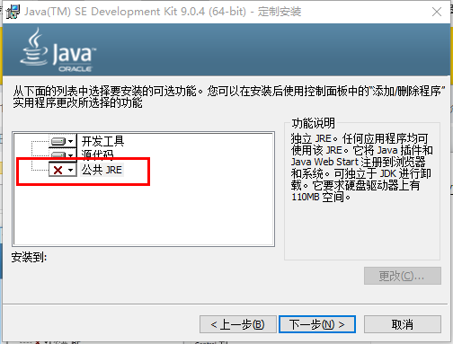


3. 修改 **系统环境变量**
   - 新建JAVA_HOME = "D:\Java\jdk-9.0.4"
   - 修改Path = "%JAVA_HOME%\bin"
   - 检查：在Windows命令窗口输入java --version，显示版本则成功。

## 1.3  JDK安装目录

JDK的bin目录有许多可执行文件：

- java：这个可执行程序其实就是JVM，运行Java程序，就是启动JVM，然后让JVM执行指定的编译后的代码；
- javac：这是Java的编译器，它用于把Java源码文件（以.java后缀结尾）编译为Java字节码文件（以.class后缀结尾）；
- jar：用于把一组.class文件打包成一个.jar文件，便于发布；
- javadoc：用于从Java源码中自动提取注释并生成文档；
- jdb：Java调试器，用于开发阶段的运行调试。

所以，JAVA的编译过程就是：

- 编写源码xxx.java
- 编译成JAVA字节码：javac xxx.java生成xxx.class
- 运行java xxx （不要加class后缀）

## 1.4  编辑器IntelliJ IDEA

快捷键：

- main回车：main方法
- sout回车：System.out.println()
- shift+F10：运行
- Alt+Enter：代码修复
- Ctrl+y：代码行删除
- Ctrl+/：注释行
- Ctrl+Shift+/：注释块
- Ctrl+d：代码行复制并粘贴
- Ctrl+Alt+L：代码格式化
- Alt+Ins：生成代码块

1. 创建一个项目，命名为`JavaTest`：(创建一个`Empty Project`项目也可以)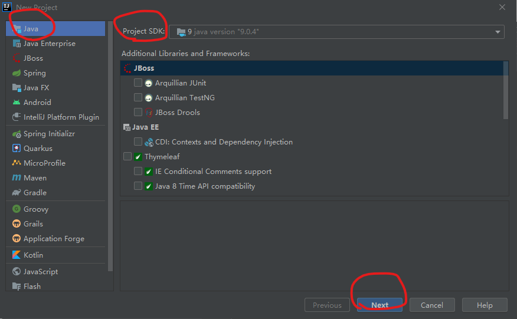

2. 创建模块：`File->project settings`，命名为`day01_test`

    > 如果是导入模块，先把模块放入正确位置，再选择Import Module

    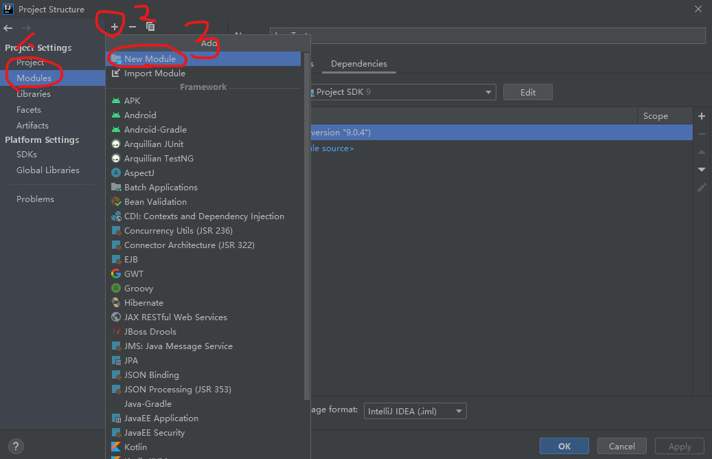

3. 创建包和类`com.baidu.Test`

    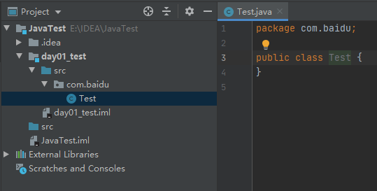


# 2  数据类型

## 2.1  基本数据类型

Java的数据类型分为两类：

* 基本数据类型：整数、浮点数、字符、布尔。
* 引用数据类型：数组、字符串、类、接口、Lambda。

基本数据类型

* 字节型：byte，1个字节
* 短整型：short，2个字节 
* 整型：int，4个字节（默认）
* 长整型：long，8个字节（建议定义时加L表示`long a = 12345678L;`）
* 单精度浮点数：float，4个字节（建议定义时加F表示`float a = 10.2F;`）
* 双精度浮点数：double，8个字节（默认）
* 字符型：char，2个字节，用于表示一个16位Unicode字符。（单引号表示`byte A = 'A';`）
* 布尔型：boolean，1个字节（默认false）

**注意**

Java中没有无符号整型，但是byte short int long可以通过包装类转换成无符号，如：

```
byte x = -1;
System.out.println(Byte.toUnsignedInt(x)); // 255
```

**控制语句**

```
public class Test {
    public static void main(String[] args) {
        int[] arr = new int[]{1, 2, 3};
        for (int i = 0; i < arr.length; i++) {
            System.out.println(arr[i]);
        }
        // 增强for，专门迭代数组和集合，底层是迭代器
        for (int value : arr) {
            System.out.println(value);
        }
    }
}
```

**两个特例**

例1：

```
public class Test {
    public static void main(String[] args) {
        short s = 1;
        s += 1;
        System.out.println(s);
    }
}
```

正常来说，1是整型，s是short型，会出错。但是+=是运算法，只计算一次，并带有强制转换的特点，所以不会出错。

例2：

```
byte b1 = 1;
byte b2 = 2;
byte b3 = 1 + 2;
byte b4 = b1 + b2;
```

b3不会出错，因为b3是在1+2计算完成之后再赋值；b4会出错，因为b1+b2有可能超出b4的范围。

## 2.2  引用数据类型

### 数组

数组是引用数据类型，数组需要指定长度和存储数据类型。

数组初始化方法：

1. 动态初始化（指定长度）：`int[] arr = new int[3]` 
2. 静态初始化（指定内容）：`char[] arr = new char[]{'a', 'b', 'c'}` 
3. 省略格式的静态初始化：`int[] arr = {1, 2, 3}`

### 包装类

基本数据类型在于效率，引用数据类型可以提供更多功能。把基本数据类型装起来，称为包装类，两个过程：装箱/拆箱。

装箱：

```
Integer i1 = new Integer(4); // 构造方法
Integer i2 = Integer.valueOf(4); // 类中的方法
```

拆箱：

```
int num = i.intValue();
```

JAVA5之后，可以自动装箱拆箱：

```
Integer i = 4;  // 自动装箱
int a = i + 5; // <==> int a = i.intValue() + 5;
```

基本数据类型都可以通过包装类和字符串转换

```
String s1 = 100 + ""; // 第一种方式
String s2 = Integer.toString(100); // 第二种方式
String s3 = String.valueOf(100); // 第三种
int a = Integer.parseInt(s1);
```

包装类中的常用方法

```
int x1 = Integer.parseInt("100");
int max = Integer.MAX_VALUE;
```

## 2.3  JVM内存划分

| 区域名称                        | 作用域                                              |
| :------------------------------ | :-------------------------------------------------- |
| 寄存器(pc Register)             | CPU使用，和我们无关                                 |
| 本地方法栈(Native Method Stack) | JVM在使用操作系统的功能时使用，和我们无关           |
| 方法区(Method Area)             | 存储可以运行的class文件                             |
| 堆(Heap)                        | 存储对象或者数组，new创建，堆里面的数据都有默认值。 |
| 栈(Stack)                       | 函数、变量等                                        |

# 3  面向对象

## 3.1  类

### 定义类

```
public class Student {
    private String name;
    public void sayHello() {
        System.out.println("hello");
    }
}
```

### 成员方法存储的位置

* .class文件存在**方法区**中
* 实例对象存在**堆**中
* 实例对象中的成员方法，在**堆**中以指针的方式，指向**方法区**中的方法

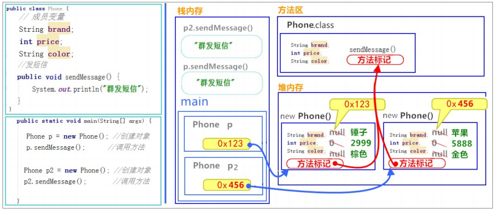

### 权限修饰符

| 修饰符        | 同一个类 | 同一个包 | 不同包的子类 | 不同包的非子类 |
| ------------- | -------- | -------- | ------------ | :------------- |
| public        | v        | v        | v            | v              |
| protected     | v        | v        | v            |                |
| package（空） | v        | v        |              |                |
| private       | v        |          |              |                |

* 其中，package也叫default，是默认的，不用写，也不能写，因为package是定义包名的。
* 一个.java文件智能包含一个public类，但可以包含多个其他类。

### 构造方法

* 构造方法是用来创建对象
* 构造方法没有返回值（不用写返回值类型）

```
public class Student {
    private String name;

    public Student() {
        this.name = "张三";
    }

    public Student(String name) {
        this.name = name;
    }
}
```

### 标准类

标准类也叫Java Bean，包括如下四部分：

* 成员变量使用private修饰；
* 每一个成员变量都有Getter和Setter方法；
* 无参构造方法；
* 有参构造方法；

### 内部类

成员内部类：定义在类的内部

* 内部类可以访问外部类成员，外部类需要创建内部类对象才能访问内部类。
* 内部类会被编译成.class文件，前面冠以外部类名`Person$Hand.class` 

### 匿名内部类

匿名内部类：没有定义，一次使用。比如传递参数时直接new一个对象。

## 3.2  关键字

### this关键字

```
public class Student {
    private String name;
    public void setName(String name) {
        this.name = name;
    }
}
```

### static关键字

* static修饰的成员变量称为类变量；
* static修饰的成员方法称为类方法，也叫静态方法；
* static修饰的代码块{}叫静态代码块。

静态方法：

* 用类直接调用静态方法
* 不能使用this关键字
* 不能访问成员变量/方法，反之可以
* 可以访问类变量/方法。
* 静态方法随着类的加载而加载，且只加载一次，存放在静态区，可以被所有对象共享。

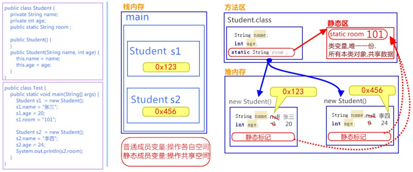


静态代码块：加载类是运行，只运行一次，优先于 main()方法和构造方法执行，用于给类变量初始化赋值。

```
public class Student {
    public static int number;

    static {
        number = 2;
    }
}
```

还有一种构造代码块：每次创建对象都会调用一次，优先于构造函数执行；不实例化对象不执行。

```
public class CodeBlock {
    static{
        System.out.println("静态代码块");
    }
    {
        System.out.println("构造代码块");
    }
}
```


### final关键字

final：不可改变，用于修饰类、方法、变量变成常量。

## 3.3  封装

封装1：this关键字

1. 使用private修饰成员变量
2. 使用getXX，setXX访问成员变量

封装2：构造方法

* 使用构造方法，在创建对象时，给成员变量赋值/或者什么都不做

`JavaBean`是JAVA类的一种编写规范，规范要求类是具体的和公共的，并且具有无参构造方法。

```
public class Student {
    private String name;

    // 无参构造
    public Student() {
    }

    // 有参构造
    public Student(String name) {
        this.name = name;
    }

    public String getName() {
        return name;
    }

    public void setName(String name) {
        this.name = name;
    }
}
```

## 3.4  继承

* JAVA 只能单继承，不能多继承；
* 所有的类默认继承Object类；
* 调用父类成员需要使用`super`关键字，和`this`区分；
* 无权访问父类中private权限的成员，可以使用getXX/setXX；
* 子类定义构造方法时，要先使用`super();`执行父类构造方法。

```
class People {
    String name = "张三";

    public void speak() {
        System.out.println("Hello");
    }
}

class Teacher extends People {
    String name = "老师";

    public void speak() {
        System.out.println(this.name);
        super.speak();
        System.out.println("Hello World");
    }
}   
```

## 3.5  多态

多态形式：

* 父类引用指向子类对象：`父类 test = new 子类()`
* 接口名称指向实现对象：`接口 test = new 实现()`

多态好处：

* 在实际应用中，父类常作为形参，传递子类对象；这样就可以只定义一个传递父类的函数，避免代码复用。

多态缺点：（通过向下转型解决）

- 无法使用子类的成员变量。
- 无法使用子类特有的成员方法。

多态转型：

* 向上转型：父类引用指向子类对象：`Animal animal = new Cat();`
* 向下转型：`Cat cat = (Cat) animal;`

转型出错：

1. 当父类引用调用子类特有的方法时会出错（需要向下转型）
2. 当向下转型，转到别的子类时会出错（猫->动物->狗）

避免转型出错：`instanceof` 

* 使用语句判断：`if (animal instanceof Cat)` 

    ```
    if (animal instanceof Cat) {
    	Cat cat = (Cat) animal;
    	cat.eat();
    }
    ```

* Java 14开始，instanceof 可以直接转型

    ```
    if (animal instanceof Cat) {
    	cat.eat();
    }
    ```

      

## 3.6  抽象类

方法或类都只是为了声明，没有主体，此时可以定义为 抽象方法/抽象类。

* 子类只能继承一个抽象类/类
* 包含抽象方法的类，必须是抽象类。
* 非抽象子类，必须重写抽象父类中的抽象方法。
* 抽象类不能创建对象
* 抽象类可以有构造方法

```
abstract class People {
    abstract public void speak();
}

class Teacher extends People {
    public void speak() {
        System.out.println("Hello World");
    }
}
```

## 3.7  接口

接口中可以包含：

* 抽象方法：必须在实现类中重写`@Override`，抽象方法可以省略`public abstract`
* 默认方法：可以重写，也可以省略；JAVA8中添加的，可以解决接口升级问题。
* 静态方法：只能使用接口名调用；
* 私有方法：只有默认方法可以调用，解决默认方法代码重用问题；
* 私有静态方法：默认方法和静态方法可以调用，解决静态方法代码重用问题；
* 可以有静态常量：`public static final int a = 1; `

注意：

* 接口没有静态代码块
* 接口没有构造方法
* 接口可以继承接口，可以被多继承。

```
interface MyInterface {
    public static final int a = 12;
    public abstract void method1();
    public default void method2() {
        // default方法，子类可以重写，也可以不重写。
    }
    public static void method3() {
        // 静态方法，只能使用接口名调用
    }
    private void method4() {
        // 私有方法，只有default方法可以调用
    }
}

class MyTest implements MyInterface {
    @Override
    public void method1() {
        // pass
    }
}
```

# 4  常用API

## 4.0  枚举类

Java没有枚举类型，但是可以使用关键字enum定义枚举类

```
public class Main {
    public static void main(String[] args) {
        Weekday day = Weekday.SUN;
    }
}

enum Weekday {
    SUN, MON, TUE, WED, THU, FRI, SAT;
}
```

其实，enum底层和定义类一样。如何给enum加入数值呢？

```
public class Main {
    public static void main(String[] args) {
        Weekday day = Weekday.SUN;
        if (day.dayValue == 6 || day.dayValue == 0) {
            System.out.println("Work at home!");
        } else {
            System.out.println("Work at office!");
        }
    }
}

enum Weekday {
    MON(1), TUE(2), WED(3), THU(4), FRI(5), SAT(6), SUN(0);

    public final int dayValue;

    private Weekday(int dayValue) {
        this.dayValue = dayValue;
    }
}
```

## 4.1  API简介

Application Programming Interface 应用程序接口，是JDK提供给我们的类的说明文档，这些类已经封装好了，只需要我们去学习使用。

## 4.2  Scanner

键盘输入

```
import java.util.Scanner;

public class Test {
    public static void main(String[] args) {
        Scanner scanner = new Scanner(System.in);
        while (scanner.hasNext()) {
            String s = scanner.next();
            System.out.println(s);
            int i = scanner.nextInt();
            System.out.println(i);
        }
    }
}
```

## 4.3  Random

生成随机数

```
import java.util.Random;

public class Test {
    public static void main(String[] args) {
        Random random = new Random();
        int i = random.nextInt(); // 随机数 0-2^8-1
        int i1 = random.nextInt(10); // 随机数 [0, 9]
    }
}
```

## 4.5  ArrayList

ArrayList是可变数组

```
import java.util.ArrayList;

public class Test {
    public static void main(String[] args) {
        ArrayList<Integer> arrList = new ArrayList<>();
        arrList.add(10);
        arrList.add(12);
        System.out.println(arrList.toString());
    }
}
```

## 4.6  String

```
public class Test {
    public static void main(String[] args) {
        String s = "hello,world!";
        System.out.println(s.indexOf('w'));
        System.out.println(s.substring(2)); // "llo,world!"
        System.out.println(s.substring(2, 4)); // "ll"
        System.out.println(s.replace("l", "w")); // "hewwo,worwd!"
        String[] ss = s.split("\\,");
        System.out.println(String.join("--", ss)); // "hello--world!"
        System.out.println(String.format("Hi %s, your score is %.2f", "John", 23.345));
    }
}
```

## 4.7  Date和SimpleDateFormat

java.util.Date  返回时间，或者一个毫秒值

java.text.DateFormat 日期格式化，是一个抽象类，无法直接使用，可以使用其子类SimpleDateFormat

```
public class Test {
    public static void main(String[] args) {
        Date date = new Date();
        System.out.println(date); // Wed Mar 17 19:58:09 CST 2021
        System.out.println(date.getTime()); // 1615982339160
        SimpleDateFormat sdf = new SimpleDateFormat("yy年MM月dd日 HH时mm分ss秒");
        System.out.println(sdf.format(date)); // 21年03月17日 20时08分08秒
    }
}
```

## 4.8  Calender日历

java.util.Calendar常用方法

public int get(int field): 返回指定字段的值

public void set(int field, int vlaue): 设置指定字段的值

```
Calendar c = Calendar.getInstance();
System.out.println(c.get(Calendar.YEAR)); // 2021
c.set(Calendar.YEAR, 2000);
System.out.println(c.get(Calendar.YEAR)); // 2000
```

## 4.9  StringBuilder

* java.lang.StringBuilder可以修改字符串。
* 早期StringBuffer也可以，并且是线程安全的，但是效率低下，所以很少使用。
* String底层是final修饰的数组，StringBuilder底层没有被final修饰的数组，且有字符串缓冲区。
* StringBuilder默认初始化长度16，自动扩容2倍。

```
StringBuilder sb = new StringBuilder("abc");
sb.append("def");
sb.delete(3, 5);
System.out.println(sb); // abcf
```

# 5  集合Collection

* java.util.Collection是List和Set的根接口（不包含Map）
* java.util提供三种集合接口List, Set, Map
* java集合设计的特点：
    * 接口和实现类分离
    * 支持泛型
    * 集合访问通过“迭代器Iterator”实现

**常用的接口和类**

Collection 接口的接口 对象的集合（单列集合）
├——-List 接口：元素按进入先后有序保存，可重复
│—————-├ LinkedList 接口实现类， 链表， 插入删除， 没有同步， 线程不安全
│—————-├ ArrayList 接口实现类， 数组， 随机访问， 没有同步， 线程不安全
│—————-└ Vector 接口实现类 数组， 同步， 线程安全
│ ———————-└ Stack 是Vector类的实现类
└——-Set 接口： 仅接收一次，不可重复，并做内部排序
├—————-└HashSet 使用hash表（数组）存储元素
│————————└ LinkedHashSet 链表维护元素的插入次序
└ —————-TreeSet 底层实现为二叉树，元素排好序

Map 接口 键值对的集合 （双列集合）
├———Hashtable 接口实现类， 同步， 线程安全
├———HashMap 接口实现类 ，没有同步， 线程不安全
│—————–├ LinkedHashMap 双向链表和哈希表实现
│—————–└ WeakHashMap
├ ——–TreeMap 红黑树对所有的key进行排序
└———IdentifyHashMap

## 5.1  Collection功能

* add(E e) 添加元素
* clear() 清空
* remove(E e) 移除元素
* contains(E 3)  判断是否包含
* isEmpty() 是否为空
* size()  大小
* toArray()  存储到数组中

## 5.2  迭代器Iterator

* java.util.Iterator接口，用于遍历集合
* Iterator是接口，不能直接用，需要实现类。
* Collection.iterator()正好可以返回实现类。

```
Collection<String> coll = new ArrayList<>();
coll.add("xxx");
Iterator<String> iter = coll.iterator();
while (iter.hasNext()) {
    System.out.println(iter.next());
}
```

* Java1.5之后出现增强for, 专门用来遍历数组和集合，内部是一个迭代器

```
for (String x: coll){
    System.out.println(x);
}
```

## 5.3  List

List有序，可重复，可以for遍历

* ArrayList：底层数据结构是数组，查询快，增删慢，线程不安全，效率高，可以存储重复元素
* LinkedList：底层数据结构是链表，查询慢，增删快，线程不安全，效率高，可以存储重复元素
* Vector：底层数据结构是数组，查询快，增删慢，线程安全，效率低，可以存储重复元素

ArrayList的扩容机制JDK1.8：

```
1、当只是对集合进行初始化，而不添加任何元素的时候，集合的底层数组长度为0
2、当给集合添加 1 个元素，集合底层数组长度扩容10
3、当给集合添加 10 个元素，集合底层数组长度还是10
4、当给集合添加 11 个元素后，集合扩容为15，呈1.5倍增长
```

ArrayList加载因子为1：当元素个数超过容量时，进行扩容。

Vector和ArrayList前面一样，但是其呈2倍增长。

## 5.4  Set

Set无顺序，不可重复，只能用迭代器遍历。元素位置由HashCode决定，加入Set的Object必须定义equals()方法。

* HashSet：底层哈希表，线程不安全，效率高，可以存储null，元素唯一性通过hashCode和equals方法保证。
* LinkedHashSet：底层是哈希表(数组+链表/红黑树)+链表，多了一个链表，用来保证元素有序。线程不安全，效率高。 
* TreeSet：底层采用二叉树来实现，元素唯一且已经排好序 。

> 唯一性：先HashCode，如果hash值不一样，直接存；如果一样，用equals判断；如果equals一样，删除；如果equals不一样，按哈希冲突存。

HashSet扩容机制：

* JDK1.8之前：哈希表=数组+链表
* JDK1.8之后：哈表表=数组+链表+红黑树 （当链表超过8(好像是8)时，变成红黑树）
* 初始数组16，加载因子为0.75，扩容增强为1倍。

## 5.5  Map

Map底层是`哈希表=数组+链表+红黑树`，但是数组中元素是`Entry<Key, Value>`；

HashTable键和值不可以是null；HashMap可以键和值可以存储null。

常用方法：

```
Map<String, Integer> map = new HashMap<>();
map.put("apple", 123);
map.put("pear", 456);
map.put(null, 123);
for (Map.Entry<String, Integer> e : map.entrySet()) {
    System.out.println(e);
}
System.out.println(map.get("apple"));
System.out.println(map.remove("apple"));
```

其他：

* HashMap存储自定义类型，必须重写hashCode和equals方法；
* 使用`TreeMap`时，放入的Key必须实现`Comparable`接口。`String`、`Integer`这些类已经实现了`Comparable`接口，因此可以直接作为Key使用。作为Value的对象则没有任何要求。 

## 5.6  Collections

java.util.Collectoins集合工具类，常用来对集合/列表进行操作，常用方法如下：

* Collections.addAll(set, element1, element2, element3,,,)添加多个元素
* Collections.sort(list) // 排序，只能是List，不能是Set
* Collections.sort(list, Comparator<? super T>) // 按规则排序

按规则排序：

```
Collections.sort(list, new Comparator<Person>() {
    @Override
    public int compare(Person p1, Person p2) {
        return p1.age - p2.age; // 升序   
    }
});
```

HashMap存放

## 5.7  Queue

`Queue<String> queue = new LinkedList<>();`常用方法：

- 通过`add()`/`offer()`方法将元素添加到队尾；
- 通过`remove()`/`poll()`从队首获取元素并删除；
- 通过`element()`/`peek()`从队首获取元素但不删除。
- 避免把`null`添加到队列，否则`poll()`方法返回`null`时，很难确定是取到了`null`元素还是队列为空。

## 5.8  Stack

Stack类是Vector的一个子类。

`Stack`只有入栈和出栈的操作：

- 把元素压栈：`push(E)`；
- 把栈顶的元素“弹出”：`pop(E)`；
- 取栈顶元素但不弹出：`peek(E)`。

在Java中，我们用`Deque`可以实现`Stack`的功能：

- 把元素压栈：`push(E)`/`addFirst(E)`；
- 把栈顶的元素“弹出”：`pop(E)`/`removeFirst()`；
- 取栈顶元素但不弹出：`peek(E)`/`peekFirst()`。

# 6  泛型

这里不解释什么是泛型，讲解如何定义泛型。

## 6.1  定义泛型

* 注意`<>`中可以填写任意字符，如果需要多个泛型，那就写多个字符。

```
class Pair<E> {
    private E first, last;
    public void setValue(E first, E last) {
        this.first = first;
        this.last = last;
    }
    public E getFirst() {
        return first;
    }
    public E getLast() {
        return last;
    }
}
```

## 6.2   含有泛型的静态方法

静态方法也可以有泛型，但是最好是单独定义一个字符。

```
class Pair<E> {
    public static <T> void method(T name) {
        System.out.println(name);
    }
}
```

## 6.3  含有泛型的接口

第一种：接口中有泛型，实现类确定泛型类型

```
interface TestInterface<E> {
    public abstract void method(E name);
}

class TestInterfaceImp implements TestInterface<String> {
    @Override
    public void method(String name) {
        System.out.println(name);
    }
}
```

第二种：接口中有泛型，实现类也有，创建对象时确定类型，如`ArrayList<>`就是。

```
interface TestInterface<E> {
    public abstract void method(E name);
}

class TestInterfaceImp<E> implements TestInterface<E> {
    @Override
    public void method(E name) {
        System.out.println(name);
    }
}
```

## 6.4  泛型原理

泛型有多种方法实现，Java使用的是擦拭法：

虚拟机将含有泛型的代码识别为Object类，即多态中的向上转型；编译器根据具体情况强制转换类型；因此：

* 泛型只能是类/包装类

* 不能判断泛型的类型，如`x instanceof Test<String>`，因为都是`Test.class`
* 泛型类中不能重复定义Object中的方法，如`equals(T t)`
* 不能获取带泛型的`Class`，如`Test<String>.class`，因为都是`Test.class`

## 6.5  泛型通配符

* 泛型通配符用`?`表示，表示不知道什么类型。

* 泛型通配符不能在创建对象时使用，只能作为方法的参数使用。

* `?`实际上和`Object`类似。

```
class Print {
    public void print (ArrayList<?> list) {
        Iterator<?> it = list.iterator();
        while (it.hasNext()) {
            System.out.println(it.next());
        }
    }
}
```

## 6.6  泛型通配符上下限

* 泛型上限，如 `? extends Number` ，代表泛型只能是`Number`的子类/本身
* 泛型下限，如`? super Integer`，代表泛型只能是`Integer`的父类/本身

上下限理解，示例：

```
public class Test {
    public static void main(String[] args) {
        getElement1(new ArrayList<Integer>()); // 正确 （子类）
        getElement1(new ArrayList<String>()); // 报错 （不想干）

        setElement2(new ArrayList<Integer>()); // 报错 （子类）
        setElement2(new ArrayList<Object>());  // 正确 （父类）
    }
    public static void getElement1(Collection<? extends Number> coll){}
    public static void setElement2(Collection<? super Number> coll){}
}

```

**上下限的重要用途**

> extends 表示可以读，但是不能写；
>
> super 表示可以写，但是不能读；

**详细理解super**

```
// 有泛型方法如下
public void setValue(Test<? super Integer> test) {}
public Test<? super Integer> getValue() {return xxx;}
```

详细理解：

* setValue写方法：可以传入 Integer/Number/Object参数值，所以能写；
* getValue读方法：假若使用读方法`Integer x = test.getValue();` 有以下几种情况：
    * 有可能是`Object`值赋给`Integer`，所以编译器报错；
    * 也有可能是`Number`值赋给`Integer`，所以编译器报错；
    * 也有可能是`Integer`值赋给`Integer`，但是编译器仍是报错（这种写法是错的）。
    * 但是，如果是`Object x = test.getValue();` 通过编译！！

**详细理解extends**

```
public void setValue(Test<? extends Number> test) {}
public Test<? extends Number> getValue() {return xxx;}
```

详细理解：

* getValue读方法：可以返回 Number/Integer/Double/Long等参数值，所以能读；
* setValue写方法：假如使用写方法`test.setValue(xxx);`，这里的xxx表示Number/Integer/Double/Long等，所以写方法表示：
    * 把`xxx`赋给`xxx`，这样肯定不行，所以编译器报错；
    * 如果是`test.setValue(null)`，表示把`null`赋给`xxx`，通过！！

# 7  异常处理

## 7.1  异常分类

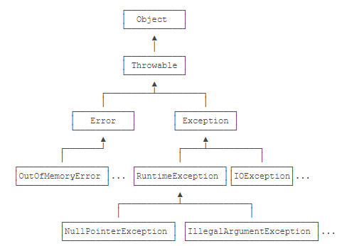

异常分类：`Error`和`Exception`；

* `Error`表示严重错误，一般无能为力：如内存耗尽、栈溢出；
* `Exception`表示应该捕获的可处理的错误；`Exception`又包括 `RuntimeException`及其子类，无需强制捕获；非`RuntimeException`（Checked Exception）需强制捕获，或者用`throws`声明； 

Java规定：

* 不需要捕获的异常，包括`Error`及其子类，`RuntimeException`及其子类。 如空指针
* 必须捕获的异常，非`RuntimeException`及其子类，这种类型的异常称为Checked Exception。如IO，SQL异常。

> RuntimeException及其子类不做强制捕获要求，不是指应用程序本身不应该捕获并处理RuntimeException。是否需要捕获，具体问题具体分析。 

编译时异常、运行时异常、错误：

* 编译时异常`java.lang.Exception `，程序正确，但因为外在的环境条件不满足引发，必须捕获；如，远程数据库名字错误。
* 运行时异常` Java.lang.RuntimeException `，不做强制捕获要求，但是是否捕获具体问题具体分析；
* 错误` java.lang.Error `，一般很少见，也很难通过程序解决，可能是环境问题，如内存耗尽。

## 7.2  处理异常

处理异常的两种方式：

* 抛出异常throw throws：将异常抛给方法调用者处理；如果是main方法，则会交给JVM处理，程序中断。
* 捕获异常try{...}catch{...}

第一种：抛出异常 throw throws

* throw是在方法中，抛出指定异常；
* throws写在方法声明处；如果是多个异常，必须全部写出，或者写出父类；
* throw throws异常必须是Exception及其子类;
* throw如果创建的是RuntimeException，可以不用处理；
* throw如果创建的是编译异常（Checked Exception），必须throws或者try...catch

```
public class Test {
    public static void main(String[] args) throws FileNotFoundException{
        String path = "c:\\a.txt";
        if (path == "c:\\a.txt") {
            throw new FileNotFoundException();
        }
    }
}
```

第二种：捕获异常

* 多个catch语句，子类必须在前面；
* finally可选，但是有无异常都会执行；

```
public static void main(String[] args) {
    try {
        process1();
        process2();
        process3();
    } catch (IOException | NumberFormatException e) {
    	e.printStackTrace();
        System.out.println("Bad input");
    } catch (Exception e) {
    	e.printStackTrace();
        System.out.println("Unknown error");
    }
}
```

## 7.3   自定义异常

* 自定义XxxException，需要继承Exception或者RuntimeException
* 自定义异常，应该定义多个构造方法

```
public class BaseException extends RuntimeException {
    public BaseException() {
        super();
    }
    public BaseException(String message) {
        super(message);
    }
}
```

# 8  新特性

## 8.1  可变参数

JDK1.5之后有了可变参数：参数类型一样，但是几个不知道[0-n]，可以使用可变参数。

注意：

* 一个方法的参数列表，最多只能有一个可变参数
* 可变参数必须写在参数末尾。

```
public class Test {
    public static void main(String[] args) {
        System.out.println(add());  // 0
        System.out.println(add(1, 2)); // 3
        System.out.println(add(1, 2, 3)); // 6
    }
    public static int add(int... arr) {
        int s = 0;
        for (int x : arr) {
            s += x;
        }
        return s;
    }
}
```

## 8.2  of方法

集合中add()方法太麻烦，因此Java 9中添加了集中集合工厂方法：在List/Set/Map中添加了一个静态方法`of`，可以一次添加多个元素。但是只能在元素个数确定的情况下使用。

* of方法只适用于List/Set/Map，不适用于接口的实现类；
* of方法返回值是一个不可以改变的集合，集合不能再使用add方法;

```
List<String> list = List.of("a", "a", "b");
Set<String> set = Set.of("a", "b", "c");
Map<String, Integer> map = Map.of("a", 1, "b", 2);
```

## 8.3  Lambda表达式/函数式接口

在创建线程时，我们一般新建Runable接口，并重写其中run()方法；

```
new Thread(new Runnable() {
    @Override
    public void run() {
        System.out.println("haha");
    }
}).start();
```

2014年，Java8中，加入了Lambda表达式：`(参数列表)->{方法体}`，这叫函数式编程

* Lambda表达式适用于单方法接口（`FunctionalInterface`）；
* 一个参数可以省略括号，一个语句可以省略花括号

```
new Thread(() -> {
    System.out.println("haha");
}).start();
```

## 8.4  函数式编程

Java8中添加了注解`@FunctionalInterface`，用于表示该接口是函数式接口：

* 有且仅有一个抽象方法
* 可以有默认、静态、私有、私有静态方法

```
public class Test {
    public static void show(MyInterface myInterface) {
        myInterface.method();
    }

    public static void main(String[] args) {
        show(() -> {
            System.out.println("hello");
        });
    }
}

@FunctionalInterface
interface MyInterface {
    public abstract void method();
}
```

> 如果一个方法的参数是 函数式接口，在使用该方法时，可以用Lambda表达式

```
public class Test {
    public static void startThread(Runnable runnable) {
        new Thread(runnable).start();
    }

    public static void main(String[] args) {
        startThread(() -> {
            System.out.println("hello");
        });
    }
}
```

> 如果一个方法的返回值是 函数式接口，在使用该方法时，可以用Lambda表达式

```
public class Test {
    public static Comparator<String> getComparator() {
        return (o1, o2) -> {return o1.length() - o2.length();};
    }

    public static void main(String[] args) {
        String[] array = {"aaa", "b", "cccc", "dddddd"};
        Arrays.sort(array, getComparator());
        System.out.println(Arrays.toString(array));
    }
}
```

## 8.5  常用的函数式接口

`java.util.function.Supplier<T>`接口仅包含一个无参方法`T get()`，用来获取一个对象。

```
public class Test {
    public static int getMax(Supplier<Integer> sup) {
        return sup.get();
    }

    public static void main(String[] args) {
        int[] array = {100, 200, 0, 10};
        System.out.println(getMax(() -> {
            int max = array[0];
            for (int x : array) {
                max = Math.max(max, x);
            }
            return max;
        }));
    }
}
```

## 8.6  方法引用

我们知道`Arrays.sort(array, Comparator<T>)`参数中有接口，需要定义`int compare(T, T)`方法，我们可以使用方法引用：

```
public class Test {
    public static void main(String[] args) {
        String[] array = new String[]{"Apple", "Orange", "Banana"};
        Arrays.sort(array, Test::cmp);
        System.out.println(String.join(", ", array));
    }

    static int cmp(String s1, String s2) {  // 方法名可以不一样
        return s1.compareTo(s2);
    }
}
```

也可以直接引用`String`类的`compareTo()`方法：

```
Arrays.sort(array, String::compareTo);
```


## 8.7  Stream流

> java.util.Stream实现的是惰性计算，它不一定存在内存中，它的结果是实时计算出来的。

```
// 创建Stream: 从of方法传入可变参数
Stream<Integer> stream1 = Stream.of(12, 15, 20, 10);
// 创建Stream: 基于Collection
Stream<Integer> stream2 = Arrays.stream(new Integer[]{12, 15, 20});
Stream<Integer> stream3 = List.of(12, 15, 20).stream();
// 遍历        
stream1.forEach(System.out::println);
```

由于`Stream<Integer>`装箱拆箱频繁，效率低，因此还提供了`IntStream`、`LongStream`和`DoubleStream`三种类型，使用方法和Stream一样：

```
IntStream is = Arrays.stream(new int[] { 1, 2, 3 });
```

**map**：映射，将一个`Stream`转换成另一个`Stream`

```
Stream<Integer> stream1 = Stream.of(12, 15, 20, 10);
stream1.map(n -> n * n).forEach(System.out::println); //平方
Stream<String> stream2 = Stream.of("A", "B", "c");
stream2.map(String::toLowerCase).forEach(System.out::println);
```

**filter**：过滤

```
IntStream stream1 = IntStream.of(12, 15, 20, 10);
stream1.filter(n -> n % 2 == 0).forEach(System.out::println);
```

**reduce**：聚合，将`Stream`的所有元素聚合成一个结果

```
int sum = IntStream.of(12, 15, 20, 10).reduce(0, (a, b) -> a + b);
System.out.println(sum);
```

实际上，这三个方法参数使用的是函数式接口：

* `map()`接收的是`Function<T, R>`接口对象，里面有转换方法`R apply(T t)`
* `filter()`接收的是`Predicate<T>`接口对象，里面有判断方法`boolean test(T t)`
* `reduce()`接收的是`BinaryOperator<T>`接口对象，里面有累加方法`T apply(T t, T u)`

**其他常用方法**

```
Stream<String> stream = Stream.of("Apple", "Pear", "Orange");
// 输出为List
List<String> list = stream.collect(Collectors.toList());
// 输出为数组
String[] array = stream.toArray(String[]::new);
// 排序
String[] array1 = stream.sorted().toArray(String[]::new);
// 自定义排序
String[] array2 = stream.sorted(String::compareToIgnoreCase).toArray(String[]::new);
// 去重
String[] array3 = stream.distinct().toArray(String[]::new);
// 截取
String[] array4 = stream.skip(0).limit(2).toArray(String[]::new); //跳过，并截取
```


# 9  IO

数据按照流向分为：输入流和输出流；

数据按照格式分为：字节流和字符流；

## 9.1  字符编码

* ASCII编码，占一个字节`[0,127]`，最高位始终是0；
* GB2312，占两个字节，最高位始终是1，以便和ASCII区分；
* Unicode，两个或多个字节表示；
* UTF-8，因为Unicode编码太长，UTF-8是一种变长编码。

Java中，char实际上是两个字节的Unicode编码，如果需要可以手动转码：

```
byte[] b1 = "Hello".getBytes(); // 按系统默认编码转换，不推荐
byte[] b2 = "Hello".getBytes("UTF-8"); // 按UTF-8编码转换
byte[] b2 = "Hello".getBytes("GBK"); // 按GBK编码转换

String s1 = new String(b1, "GBK"); // 按GBK转换
String s2 = new String(b2, StandardCharsets.UTF_8); // 按UTF-8转换
```

## 9.2  File

java.io.File类：File对象既可以表示文件，也可以表示目录，File对象不改变磁盘，只有调用相应方法才会改变。

```
File f = new File("D:\\test");
// f.isFile();
// f.isDirectory();
// f.createNewFile(); // 创建文件
// f.mkdir();       // 创建目录
// f.delete();      // 删除
File[] files = f.listFiles();  // 获取子目录和文件
```

## 9.3  字节流

`java.io.InputStream`是接口，有常用类`Java.io.FileOutputStream`，构造函数如下：

* `FileOutputStream(String name)`	创建对象，并创建一个新文件
* `FileOutputStream(String name, boolean append)`	是否在文件中追加

```
public class Test {
    public static void main(String[] args) throws IOException {
        OutputStream output = new FileOutputStream("F:\\test.txt");
        byte[] buffer = {48, 65, 97};
        output.write(buffer);
        output.write("\r\n".getBytes());  // Linux只需要\n
        output.write(buffer);
        output.close();
    }
}
```


`Java.io.InputStream`是接口，有常用类`Java.io.FileInputStream`，构造函数如下：

* `FileInputStream(String name)`，读取磁盘中的文件

```
public class Test {
    public static void main(String[] args) throws IOException {
        InputStream input = new FileInputStream("F:\\test.txt");
        byte[] buffer = new byte[1024];
        while (input.read(buffer) != -1) {
            System.out.println(new String(buffer));
        }
        input.close();
    }
}
```

## 9.4  字符流

当使用字节流读取中文时，可能不会显示完整的字符，因为一个中文字符可能占用多个字节，所以Java提供了字符流，以字符为单位读写数据，专门用于处理文本文件。

`java.io.FileReader`

```
public class Test {
    public static void main(String[] args) throws IOException {
        FileReader reader = new FileReader("F:\\test.txt");
        char[] buffer = new char[1024];
        int len = 0;
        while ((len = reader.read(buffer)) != -1) {
            System.out.println(new String(buffer));
        }
    }
}
```

`FileReader`实际上来源于`FileInputStream`，因此，如何将`FileInputStream`转换为`FileReader`？可以通过`InputStreamReader`：

```
Reader reader = new InputStreamReader(new FileInputStream("src/readme.txt"), "UTF-8")
```

`java.io.FileWriter`

```
public class Test {
    public static void main(String[] args) throws IOException {
        FileWriter writer = new FileWriter("F:\\test.txt");
        writer.write("你好"); // 将数据写到内存缓冲区（字符变字节）
        writer.flush(); // 刷新到文件
        writer.close();
    }
}
```

 `OutputStreamWriter`就是一个将任意的`OutputStream`转换为`Writer`的转换器：

```
Writer writer = new OutputStreamWriter(new FileOutputStream("readme.txt"), "UTF-8")
```

## 9.5  捕获异常

```
FileWriter writer = null;
try {
    writer = new FileWriter("F:\\test.txt");
    writer.write("你好");
} catch (IOException e) {
    e.printStackTrace();
} finally {
    if (writer != null) {
        try {
            writer.close();
        } catch (IOException e) {
            e.printStackTrace();
        }
    }
}
```

Java7之后，在try后面定义了一个`()`，里面可以创建流对象，并且不用写finally：

```
try (FileWriter writer = new FileWriter("F:\\test.txt");) {
    writer.write("你好");
} catch (IOException e) {
    e.printStackTrace();
}
```

## 9.6   缓冲区

`Java.io.BufferedInputStream` , `Java.io.BufferedOutputStream`, `Java.io.BufferedReader`, `Java.io.BufferedWriter` 用法大致一样。

```
public class Test {
    public static void main(String[] args) throws IOException {
        FileOutputStream fos = new FileOutputStream("F:\\test.txt");
        BufferedOutputStream bos = new BufferedOutputStream(fos);
        bos.write("hello".getBytes());
        bos.flush();
        bos.close();
    }
}
```

## 9.7  Files工具类

`java.io`中的类都是同步的，`java.nio`中的都是异步的。`Files`和`Paths`是`java.nio`包里面的类，封装了很多读写文件的简单方法。

* `Files`提供的读写方法，受内存限制，只能读写小文件，例如配置文件等

```
byte[] content1 = Files.readAllBytes(Paths.get("/path/to/file.txt"));
String content2 = Files.readString(Paths.get("/path/to/file.txt"));

Files.write(Paths.get("/path/to/file.txt"), hello".getBytes());
Files.writeString(Paths.get("/path/to/file.txt"), "文本内容...");
```

# 10  多线程

并发：两个或多个事件在用一时间段内发生（交替执行）；

并行：两个或多个事件在同一时刻同时发生（如多核CPU同时处理多个线程）。

进程：程序执行/资源分配的最小单位，进程内资源共享，一个应用可以有一个或多个进程。

线程：线程是进程执行的单元，是CPU调度的最小单位。

进程线程其他：

1. 进程间不会相互影响，一个线程挂掉会导致整个进程挂掉。
2. 进程可以给内存上锁：一个线程用完，别的线程才能用（互斥锁）。
3. 进程可是限制内存使用量：如最多3个线程同时使用。

线程进程联系和区别：

1. **资源** 进程单独占有一定的内存地址空间，所以进程间存在内存隔离，数据时分开的，数据共享复杂但是同步简单，各个进程之间互不干扰；而线程共享所属进程占有的内存地址空间和资源，数据共享简单，但是同步复杂。
2. **可靠性** 进程单独占有一定的内存地址空间，一个进程出现问题不会影响其他进程，不影响主程序的稳定性，可靠性高；一个线程崩溃可能影响整个程序的稳定性，可靠性较低。
3. **开销** 进程单独占有一定的内存地址空间，进程的创建和销毁不仅需要保存寄存器和栈信息，还需要资源的分配回收以及页调度，开销较大；线程只需要保存寄存器和栈信息，开销较小。 

线程/CPU调度：

1. 分时调度：平均时间
2. 抢占式调度：优先级高的先执行（JVM就是这种方式）

## 10.1  创建多线程

创建线程的两种方式：

1. 继承`java.lang.Thread`类，重写run()方法，创建对象，调用start()方法。

    ```
    public class Test {
        public static void main(String[] args) {
            Thread t = new Thread();
            t.start();
    
        }
    }
    
    class MyThread extends Thread {
        @Override
        public void run() {
            System.out.println("start new thread!");
        }
    }
    ```

2. 实现`java.lang.Runable`接口，重写run()方法，创建对象，赋给Thread对象。

    ```
    public class Main {
        public static void main(String[] args) {
            Thread t = new Thread(new MyRunnable());
            t.start(); // 启动新线程
        }
    }
    
    class MyRunnable implements Runnable {
        @Override
        public void run() {
            System.out.println("start new thread!");
        }
    }
    ```

线程常用的方法：

1. `Thread.currentThread().getName();` 获取当前线程.名称
2. `thread.setName("xxx");`设置线程名称
3. `Thread.sleep(1000);`设置线程停止1000毫秒

Runable的好处：

1. Runable避免了单继承的局限性
2. 增强了程序的扩展性

## 10.2  线程安全

多个线程访问同一资源时，容易出现线程安全（如卖出同样的车票）。此时需要使用JAVA的同步机制，有三种方式：

1. 同步代码块：用synchronized关键字修饰代码块
2. 同步方法：把synchronized修饰方法
3. Lock锁：比synchronized更全面、更面向对象的方法。

**同步代码块**：synchronized关键字用于方法中的代码块，表示对该区域资源进行互斥访问。

同步锁：最多允许一个线程拥有同步锁,谁拿到锁就进入代码块,其他的线程只能在外等着。同步锁只是一个概念，在编程时锁对象可以是任意类型。

```
public class Test {
    public static void main(String[] args) {
        MyRunableImpl r = new MyRunableImpl();
        Thread t1 = new Thread(r);
        Thread t2 = new Thread(r);
        Thread t3 = new Thread(r);
        t1.start();
        t2.start();
        t3.start();
    }
}

class MyRunableImpl implements Runnable {
    private int ticker = 100;
    Object lock = new Object(); // 同步锁，只是一个概念，锁对象可以是任意类型
    @Override
    public void run() {
        while (true) {
            synchronized (lock) {
                if (ticker > 0) {
                    try {
                        Thread.sleep(100);
                    } catch (InterruptedException e) {
                        e.printStackTrace();
                    }
                    System.out.println(Thread.currentThread().getName() + ": " + ticker);
                    ticker--;
                }
            }
        }
    }
}
```

**同步方法**：使用synchronized修饰的方法,就叫做同步方法,保证A线程执行该方法的时候,其他线程只能在方法外等着。如：（它的同步锁就是该类的对象`this`，静态方法就是类本身`xxx.class`字节码文件）

`public static synchronized void method(){可能存在线程安全问题的代码}` 

**Lock锁**：也叫同步锁，三步完成，如下：

```
import java.util.concurrent.locks.Lock;
import java.util.concurrent.locks.ReentrantLock;

class MyRunableImpl implements Runnable {
    private int ticker = 100;
    // 1. 在成员位置创建一个ReentrantLock对象
    Lock l = new ReentrantLock();

    @Override
    public void run() {
        while (true) {
            // 2. 在问题代码块前调用lock获取锁
            l.lock();
            if (ticker > 0) {
                try {
                    Thread.sleep(100);
                    String name = Thread.currentThread().getName();
                    System.out.println(name + ": " + ticker--);
                } catch (InterruptedException e) {
                    e.printStackTrace();
                } finally {
                    // 3. 问题代码后unlock释放锁
                    l.unlock();
                }
            }
        }
    }
}
```

## 10.3  线程状态

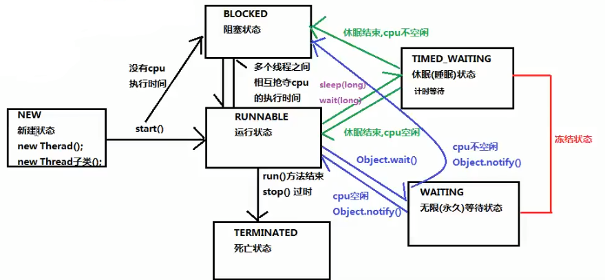

1. [`NEW`]新建状态：刚给创建，等待start()调用；   
2. [`RUNNABLE`]可运行状态：抢到CPU，要么在运行，要么在队列中等待运行；
3. [`BLOCKED`]阻塞状态：资源被锁住，等待资源解锁；
4. [`WAITING`]无限等待状态：该线程需要别的线程来唤醒；
5. [`TIMED_WAITING`]睡眠状态：等待自己的睡眠时间结束；
6. [`TERMINATED`]死亡状态：运行结束。

睡眠状态方法：

1. sleep(5000)
2. wait(5000)

无限等待状态唤醒方法：

1. notify()：唤醒一个线程
2. notifyAll()：唤醒所有等待的线程

## 10.4  线程通信/等待唤醒机制

为什么要线程之间通信：线程完成同一任务时，有时需要操作同一份数据。

如何保证线程间通信有效利用资源：避免对同一资源的争夺，等待唤醒机制。

等待唤醒方法：

1. wait()：线程不再活动，等待被唤醒
2. notify()/notifyAll()：唤醒一个/所有线程。

注意：

1. wait()和notify()必须要由同一个锁对象调用；
2. 锁对象可以是任意的，都属于Object类，所以wait()和notify()属于Object的方法；
3. wait()和notify()必须在同步代码块或同步函数中使用。

实现流程：

1. 消费者线程：调用wait()，等待被唤醒
2. 生产者进程：调用notify()，唤醒消费者

注意：

1. 等待和唤醒只有一个在执行，必须使用同步代码块包裹起来
2. 使用锁对象必须唯一

```
public class Test {
    public static void main(String[] args) {
        Object obj = new Object();
        new Thread() {
            @Override
            public void run() {
                // 1. 调用wait()
                synchronized (obj) {
                    System.out.println("我要两个包子...");
                    try {
                        obj.wait();
                    } catch (InterruptedException e) {
                        e.printStackTrace();
                    }
                }
                // 3. 被唤醒之后
                System.out.println("吃包子....");
            }
        }.start();

        new Thread() {
            @Override
            public void run() {
                try {
                    Thread.sleep(5000);
                } catch (InterruptedException e) {
                    e.printStackTrace();
                }
                // 2. 唤醒 notify()
                synchronized (obj) {
                    System.out.println("包子做好了...");
                    obj.notify();
                }
            }
        }.start();
    }
}
```

## 10.5  线程池

如果线程很多，每个很快执行完毕，就会导致创建和销毁线程比使用线程时间还长。有没有方法可以使线程复用，执行完一个任务，不被销毁，继续执行其他任务。JAVA中线程池就是这个作用。

线程池：容纳多个线程的容器，线程可以复用。

线程池好处：

1. 提高响应速度：不用等待线程创建
2. 降低资源消耗：减少创建销毁次数，每个线程被重复利用。
3. 提高线程的可管理性：调整线程数量，防止过多线程消耗内存。

执行线程池的工具：`java.util.concurrent.Executor`，可以调用里面的静态方法，创建线程池对象。

1. 创建线程池对象：`public static ExecutorService newFixedThreadPool(int nThreads)` 
2. 实现`Runnable`接口，重写run方法，设置线程任务
3. 调用`ExecutorService`的submit方法，传递线程任务，开启线程
4. 销毁线程池（一般不用，好不容易创建了，为什么要马上销毁）

 ```
import java.util.concurrent.Executors;
import java.util.concurrent.ExecutorService;

public class Test {
    public static void main(String[] args) {
        ExecutorService es = Executors.newFixedThreadPool(2);
        for (int i = 0; i < 100; i++) {
            es.submit(new RunnableImpl());
            es.submit(new RunnableImpl());
        }
    }
}

class RunnableImpl implements Runnable {
    @Override
    public void run() {
        System.out.println(Thread.currentThread().getName());
    }
}
 ```

# 11  反射

反射Reflection：Java的反射是指程序在运行期可以拿到一个对象的所有信息。

> Java虚拟机将xx.class加载到方法区内存后，还会创建一个xx的`Class`实例并关联起来，`Class`实例包含该xx.class的所有信息，所以，获取Class实例就叫反射。

Java有三种方法可以获取xx.class的Class实例。

1. 可以通过静态变量获取`Class cls = Test.class`;
2. 通过实例对象的方法获取`Class cls = test.getClass();`
3. 通过完整类名获取`Class cls = Class.forName("java.lang.String");`

# 12  注解

注解有三类：

* 编译器使用的注解，如`Override`，让编译器检查该方法是否正确复写，不会被编译到.class文件;
* 工具处理`.class`文件使用的注解，会被编译到.class文件，底层库使用，一般用不到；
* 程序运行期能够读取的注解，会在加载后一直存在JVM中，常用。

定义注解：

* 注解可以有参数，参数可以是所有类型；
* 参数必须是常量，所以定义时就确定了参数的取值；
* 每个注解会有一个名为`value`的参数，用时可以只写参数值。

示例：

```
@Target(ElementType.METHOD)
public @interface Report {
    int type() default 0;
    String level() default "info";
    String value() default "";
}
```

# 13 网络编程

网络通信协议（OSI七层协议、TCP/IP四层协议）：

1. 物理链路层：
2. 网络层：ICMP/IGMP/IP/ARP/RARP
3. 传输层：TCP/UDP（）
4. 应用层：HTTP/SMTP/FTP/DNS

`java.net`包提供了两种常见的网络协议的支持：TCP/UDP

网络编程三要素：协议、IP地址、端口号

IP地址：

1. IPv4：32位，4组，每组1个字节，2011年已经分配完毕
2. IPv6：128位，8组，每组16个字节，`ABCD:EF01:2345:6789:ABCD:EF01:2345:6789`  

端口号：

1. 取值0-66535，其中0-1023已被知名网络服务占用，普通应用程序使用1024以上的端口号。

## 13.1  TCP编程

在Java中，提供了两个类用于实现TCP通信：

1. 客户端：`java.net.Socket` 类表示。创建`Socket`对象，向服务端发出连接请求，服务端响应请求，两者建立连接开始通信。
2. 服务端：`java.net.ServerSocket` 类表示。创建`ServerSocket`对象，相当于开启一个服务，并等待客户端的连接。

客服端和服务器交换通过IO流，服务器必须明确两件事：

1. 通过`accept()`获取客户端`Socket`对象；
2. 服务器本身没有IO流，但是可以使用客服端的IO流和客户端交互。

**简单的TCP通信**

客户端编程：

1. 【创建对象】创建客户端对象`Socket(ip, port)`，本机IP和端口号；
2. 【获取输出流】使用`Socket`的`getOutputStream()`获取输出流`OutputStream`的对象；
3. 【发送数据】使用`OutputStream`的`write()`给数据给服务器；
4. 【获取输入流】使用`Socket`的`getInputStream()`获取输入流`InputStream`的对象；
5. 【读数据】使用`InputStream`的`read()`获取服务器的数据；
6. 【释放资源】释放资源`socket.close();` 。

服务器编程：

1. 【创建对象】创建服务器对象`ServerSocket(端口号)` ；
2. 【获取客户端】使用`ServerSocket`的`accept()`获取客户端对象`Socket`；
3. 【获取输入流】使用`Socket`的`getInputStream()`获取输入流`InputStream`的对象；
4. 【获取数据】使用`InputStream`的`read()`获取客服端发送的数据；
5. 【获取输出流】使用`Socket`的`getOutputStream()`获取输出流`OutputStream`的对象；
6. 【返回数据】使用`OutputStream`的`write()`给客户端发送数据；
7. 【释放资源】释放资源`socket.close()`和`server.close()`。

先写服务器代码，然后开启服务器：

```
import java.io.IOException;
import java.io.InputStream;
import java.io.OutputStream;
import java.net.ServerSocket;
import java.net.Socket;

public class TCPServer {
    public static void main(String[] args) throws IOException {
        // 1. 创建对象
        ServerSocket server = new ServerSocket(8888);
        // 2. 获取客户端
        Socket socket = server.accept();
        // 3. 获取输入流
        InputStream input = socket.getInputStream();
        byte[] bytes = new byte[1024];
        // 4. 获取数据
        int len = input.read(bytes);
        System.out.println(new String(bytes, 0, len));
        // 5. 获取输出流
        OutputStream output = socket.getOutputStream();
        // 6. 返回数据
        output.write("我是服务器".getBytes());
        // 7. 释放资源
        socket.close();
        server.close();
    }
}
```

客户端代码，开启客服端：

```
import java.io.IOException;
import java.io.InputStream;
import java.io.OutputStream;
import java.net.Socket;

public class TCPClient {
    public static void main(String[] args) throws IOException {
        // 1. 创建对象
        Socket socket = new Socket("127.0.0.1", 8888);
        // 2. 获取输出流
        OutputStream output = socket.getOutputStream();
        // 3. 发送数据
        output.write("你是谁".getBytes());
        // 4. 获取输入流
        InputStream input = socket.getInputStream();
        byte[] bytes = new byte[1024];
        // 5. 读数据
        int len = input.read(bytes);
        System.out.println(new String(bytes, 0, len));
        // 6. 释放资源
        socket.close();
    }
}
```

# 14  单元测试

## 14.1  Junit测试

步骤：

1. 定义一个测试类

    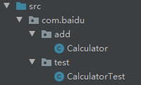

2. 编写测试类

    > 测试方法中，一般用断言判断结果

    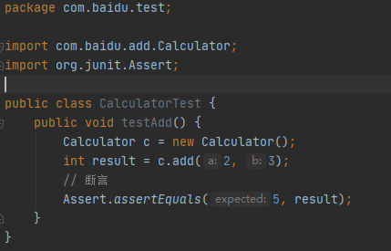

3. 给方法添加注解`@Test`

4. 在`@Test`上使用`Alt+Enter`，根据提示，导入Junit依赖环境。

5. 运行测试方法

    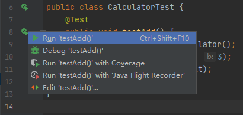

## 14.2  Fixture

在测试时，经常会遇到对象初始化等操作，JUnit提供了编写测试前准备、测试后清理的固定代码，我们称之为Fixture。

```
@Before
public void init() {
    System.out.println("所有方法之前运行");
}

@After
public void close() {
    System.out.println("所有方法之后运行");
}
```

# 15  JDBC

JDBC是Java DataBase Connectivity的缩写，它是Java程序访问数据库的标准接口。 

我们在Java代码中如果要访问MySQL，那么必须编写代码操作JDBC接口。注意到JDBC接口是Java标准库自带的，所以可以直接编译。而具体的JDBC驱动是由数据库厂商提供的，例如，MySQL的JDBC驱动由Oracle提供。因此，访问某个具体的数据库，我们只需要引入该厂商提供的JDBC驱动，就可以通过JDBC接口来访问，这样保证了Java程序编写的是一套数据库访问代码，却可以访问各种不同的数据库。

## 15.1  JDBC

JDBC示例：

1. 导入jar包

    > 创建libs文件夹；复制jar包到libs；右键libs->Add as Library；

    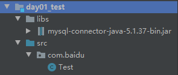

2. 连接数据库（要保证数据库正确，有表）

    >CREATE DATABASE IF NOT EXISTS db1;
    >USE db1;
    >DROP TABLE IF EXISTS stu;
    >CREATE TABLE stu
    >(
    >   id   INT NOT NULL AUTO_INCREMENT,
    >   NAME VARCHAR(20),
    >   age  INT,
    >   score INT,
    >   PRIMARY KEY (id)
    >);
    >USE db1;
    >INSERT INTO stu VALUES
    >(NULL, '张三', 18, 80),
    >(NULL, '李四', 19, 90),
    >(NULL, '王五', 20, 90),
    >(NULL, '赵六', 18, 80);
    
    ```
    public class Test {
        public static void main(String[] args) throws Exception {
            // 1. 注册驱动
            Class.forName("com.mysql.jdbc.Driver");
            // 2. 获取数据库连接对象
            Connection conn = DriverManager.getConnection("jdbc:mysql://localhost:3306/db1", "root", "root");
            // 3. 定义sql语句
            String sql = "update stu set score=80 where id=1";
            // 4. 获取sql执行对象
            Statement stmt = conn.createStatement();
            // 5. 执行sql
            int count = stmt.executeUpdate(sql);
            // 6. 处理结果
            System.out.println(count);
            // 7. 释放资源
            stmt.close();
            conn.close();
        }
    }
    ```


JDBC的核心API：

1. DriverManager 驱动管理对象，返回数据库连接对象

    - URL参数如果是本地 可以省略 `jdbc:mysql:///stu`
    - 处理乱码：`jdbc:mysql///stu?characterEncoding=utf8` 

2. Connection 数据库连接对象，用于创建一条SQL语句对象

    - `Statement stmt = conn.createStatment();`
    - `PreparedStatment pstmt  = conn.prepareStatement(sql);`
    - `setAutoCommit(boolean);` 开始事务（使用方式见，JDBC事务）
    - `commit();` 提交事务
    - `rollback();` 回滚事务

3. Statement 执行静态sql对象

    - `boolean execute(sql);` 执行任意sql
    - `int executeUpdate(sql);` insert, update, delete, create, alter, drop（返回值是影响的行数）
    - `ResultSet executeQuery(sql);` 查找

4. PreparedStatment 执行动态sql对象

    > SQL注入问题：在用户密码和数据库匹配时，如果SQL语句是：`select * from  user where name='Tom' and password='root' or 1=1;`  则返回所有查询结果。所以 使用PreparedStatment匹配SQL语句中的占位符`？`，可以防止SQL注入问题。

    ```
    // 定义sql
    String sql = "select * from user where name=? and password=?";
    // 获取执行sql的对象
    PreparedStatement  pstmt = conn.getpreparedStatement(sql);
    // 赋值
    pstmt.setString(1, "Tom");
    pstmt.setString(2, "123");
    // 执行
    ResultSet rs = pstmt.executeQuery();
    ```

5. ResultSet：执行结果

    ```
    ResultSet rs = stmt.executeQuery(sql);
    while (rs.next()) {
        int id = rs.getInt(1);  // 根据列号
        String name = rs.getString("name");  // 根据列名
        System.out.println(id + ": " + name);
    }
    ```

## 15.2  JdbcUtils

如果一个功能经常要用到（代码重复），就把这个功能做成工具类。

解决：

1. 工具类中定义许多静态方法，通过传递参数解决；
2. 如果不想传参，则把参数放在配置文件`jdbc.properties`中传递；
3. 配置文件只需要读取一次即可，所以把读取配置文件代码放在静态代码块中。

最终如下：

1. 数据库（同15.1节）

2. JavaBean

    ```
    public class Stu {
        private int id;
        private String name;
        private int age;
        private int score;
        Getter...
        Setter...
    }
    ```

3. src目录下创建配置文件`jdbc.properties` 

    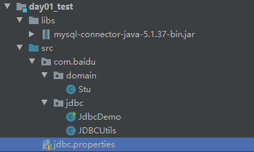

    ```
    url=jdbc:mysql://localhost:3306/db1
    user=root
    password=root
    driver=com.mysql.jdbc.Driver
    ```

4. 创建工具类 `JDBCUtils.java`

    ```
    import java.io.FileReader;
    import java.io.IOException;
    import java.net.URL;
    import java.sql.*;
    import java.util.Properties;
    
    public class JDBCUtils {
        private static String url;
        private static String user;
        private static String password;
        private static String driver;
    
        static {
            try {
                // 获取绝对路径
                ClassLoader classLoader = JDBCUtils.class.getClassLoader();
                URL res = classLoader.getResource("jdbc.properties");
                String path = res.getPath();
                // 加载配置文件
                Properties pro = new Properties();
                pro.load(new FileReader(path));
                url = pro.getProperty("url");
                user = pro.getProperty("user");
                password = pro.getProperty("password");
                driver = pro.getProperty("driver");
                // 注册驱动
                Class.forName(driver);
            } catch (IOException | ClassNotFoundException e) {
                e.printStackTrace();
            }
        }
    
        public static Connection getConnection() throws SQLException {
            return DriverManager.getConnection(url, user, password);
        }
    
        public static void close(Statement stmt, Connection conn) {
            if (stmt != null) {
                try {
                    stmt.close();
                } catch (SQLException throwables) {
                    throwables.printStackTrace();
                }
            }
            if (conn != null) {
                try {
                    conn.close();
                } catch (SQLException throwables) {
                    throwables.printStackTrace();
                }
            }
        }
    
        public static void close(Statement stmt, Connection conn, ResultSet rs) {
            if (rs != null) {
                try {
                    rs.close();
                } catch (SQLException throwables) {
                    throwables.printStackTrace();
                }
            }
            close(stmt, conn);
        }
    }
    ```

5. 数据库连接（测试工具类）

    ```
    import java.sql.*;
    
    public class JdbcDemo {
        public static void main(String[] args) {
            Connection conn = null;
            Statement stmt = null;
            ResultSet rs = null;
            try {
                conn = JDBCUtils.getConnection();
                stmt = conn.createStatement();
                String sql = "select * from stu";
                rs = stmt.executeQuery(sql);
                while (rs.next()) {
                    int id = rs.getInt("id");
                    String name = rs.getString("name");
                    System.out.println(id + ": " + name);
                }
            } catch (SQLException throwables) {
                throwables.printStackTrace();
            } finally {
                JDBCUtils.close(stmt, conn, rs);
            }
        }
    }
    ```

## 15.3  JDBC控制事务

使用Connection对象管理事务：

- `setAutoCommit(boolean);` 设置为false，开启事务
- `commit();` 提交事务
- `rollback();` 回滚事务

案例：

```
Connection conn =  null;
PrepareStatment ps = null;
try{
	conn = JdbcUtils.getConnection();
	conn.setAutoCommit(false); // 开启事务
	ps = conn.prepareStatment("update stu set score=? where name=?");
	ps.setInt(1, 90);
	ps.setString(2, "张三");
	ps.executeUpdate();
	conn.commit(); // 提交事务
} catch () {
	conn.rollback(); // 回滚事务
} finally {
	JdbcUtils.close(ps, conn);
}
```

## 15.4  JDBC连接池

之前都是每次连接数据库，执行完sql立马释放资源，降低了执行效率，因此提出数据库连接池。

1. 接口：javax.sql.DataSourrce，由驱动程序供应商实现数据库连接池
    - 从连接池获取连接：`Connection conn = ds.getConnection()`
    - 将连接归还连接池：`conn.close()` ，归还给连接池
2. 常见数据连接池实现：
    - C3P0：（不知道谁提供的）
    - Druid：阿里巴巴提供

C3P0连接池技术：

1. 导入jar包
    - 导入mysql连接驱动；
    - 导入`c3p0-0.9.5.2.jar`，以及依赖包`mchange-commons-java-0.2.12.jar`
2. 定义配置文件
    - 直接将配置文件`c3p0-config.xml`或者`c3p0.properties`放在src目录下。
    - 定义一下数据库等
3. 创建数据库连接池对象`DataSource ds  = new ComboPooledDataSource();`
4. 获取连接：`Connection conn = ds.getConnection();`

## 15.5  Druid连接池

连接池使用：

1. 导入jar包`druid-1.0.9.jar`

2. 导入配置文件（任意名称，任意位置）`druid.properties`

3. 获取连接池对象：通过工厂类获取

4. 获取连接对象

    ```
    public class DruidDemo {
        public static void main(String[] args) throws Exception {
            // 加载配置文件
            InputStream input = DruidDemo.class.getClassLoader().getResourceAsStream("druid.properties");
            Properties pro = new Properties();
            pro.load(input);
            // 获取连接池对象
            DataSource ds = DruidDataSourceFactory.createDataSource(pro);
            // 获取连接对象
            Connection conn = ds.getConnection();
            System.out.println(conn);
        }
    }
    ```

工具类：

1. 定义一个类JDBCUtils
2. 提供静态代码块加载配置文件，初始化连接池对象
3. 提供方法：
    - 获取连接池的方法
    - 获取连接方法
    - 释放资源

例子，工具类代码：

```
import com.alibaba.druid.pool.DruidDataSourceFactory;
import javax.sql.DataSource;
import java.io.IOException;
import java.sql.*;
import java.util.Properties;

public class JDBCUtils {
    private static DataSource ds;

    static {
        Properties pro = new Properties();
        try {
            pro.load(JDBCUtils.class.getClassLoader().getResourceAsStream("druid.properties"));
            ds = DruidDataSourceFactory.createDataSource(pro);
        } catch (IOException e) {
            e.printStackTrace();
        } catch (Exception e) {
            e.printStackTrace();
        }
    }

    public static Connection getConnection() throws SQLException {
        return ds.getConnection();
    }

    public static void close(Statement stmt, Connection conn) {
        if (stmt != null) {
            try {
                stmt.close();
            } catch (SQLException throwables) {
                throwables.printStackTrace();
            }
        }
        if (conn != null) {
            try {
                conn.close();
            } catch (SQLException throwables) {
                throwables.printStackTrace();
            }
        }
    }

    public static void close(ResultSet rs, Statement stmt, Connection conn) {
        if (rs != null) {
            try {
                rs.close();
            } catch (SQLException throwables) {
                throwables.printStackTrace();
            }
        }
        close(stmt, conn);
    }

    public static DataSource getDataSource() {
        return ds;
    }
}
```

工具类测试代码

```
import java.sql.Connection;
import java.sql.PreparedStatement;
import java.sql.SQLException;

public class DruidDemo2 {
    public static void main(String[] args) {
        Connection conn = null;
        PreparedStatement pstmt = null;
        try {
            conn = JDBCUtils.getConnection();
            String sql = "insert into stu values(?, ?, ?, ?)";
            pstmt = conn.prepareStatement(sql);
            pstmt.setInt(1, 5);
            pstmt.setString(2, "测试");
            pstmt.setInt(3, 100);
            pstmt.setInt(4, 100);
            int count = pstmt.executeUpdate();
            System.out.println(count);

        } catch (SQLException throwables) {
            throwables.printStackTrace();
        } finally {
            JDBCUtils.close(pstmt, conn);
        }
    }
}
```

## 15.6  JDBC Template

JDBC工具类已经很好用了，但是创建连接对象、创建执行对象、执行sql语句等还是很复杂。

Spring框架对JDBC进行简单封装，提供了JDBC Template对象，简化了JDBC开发，只需要关注执行sql和结果。

1. 导入JdbcTemplate的jar包（5个）+mysql连接jar包+Druid连接池jar包

2. 创建JdbcTemplate对象（依赖于数据源DataSource）

    - `JdbcTemplate template= new JdbcTemplate(ds);`

3. 调用JdbcTemplate的方法完成增删改查

    - update(): 增删改

        ```
    String sql = "update stu set age=18 where id=?";
        int count = template.update(sql, 5);
        ```
    
    - queryForMap(): 查询一条记录

        ```
    String sql = "select * from emp where id=?";
        Map<String, Object> map = temp.queryForMap(sql, 1);
        ```
    
    - queryForList(): 封装为List对象
    
        ```
        String sql = "select * from emp";
    List<Map<String, Object>> list = temp.queryForList(sql);
        for (Map<String, Object> map : list) {
    	System.out.println(map);
        }
        ```
    
    - query(): 封装为JavaBean对象
    
        ```
        String sql = "select * from emp";
    List<Emp> list = temp.query(sql, new BeanPropertyRowMapper<Emp>(Emp.class));
        for (Emp emp : list) {
    	System.out.println(emp);
        }
        ```
    
    - queryForObject(): 封装为基本类型对象，用于聚合函数
    
    ```
        String sql = "select count(*) from emp";
        Long total = temp.queryForObject(sql, Long.class);
        System.out.println(total);
        ```
    

一个简单的例子：（连接池等都是template完成，不需要自己写）

```
public class DruidDemo {
    public static void main(String[] args) throws Exception {
        // 加载配置文件
        InputStream input = DruidDemo.class.getClassLoader().getResourceAsStream("druid.properties");
        Properties pro = new Properties();
        pro.load(input);
        // 获取连接池对象
        DataSource ds = DruidDataSourceFactory.createDataSource(pro);
        // 获取连接对象
        JdbcTemplate temp = new JdbcTemplate(ds);
        String sql = "select * from stu where id=?";
        Map<String, Object> map = temp.queryForMap(sql, 1);
        System.out.println(map);
        // {id=1, name=张三, age=18, score=80}
    }
}
```

