# vitepress+github搭建个人博客

# 项目搭建

## 环境&项目初始化

安装node.js

安装git

创建项目

```
# 创建文件夹
mkdir zjc_vite & cd zjc_vite

# 全局安装yarn
npm install -g yarn

# 初始化项目（一直回车）
yarn init

# 安装vitepress
yarn add --dev vitepress
```

项目结构如下，**请自行创建没有的目录/文件**。

```
docs 
	./vitepress
		config.ts 	// 定义导航栏、侧边栏
	public		// 图片等公共资源
	articels	// 博客
	index.md	// 定义网站首页
package.json
```

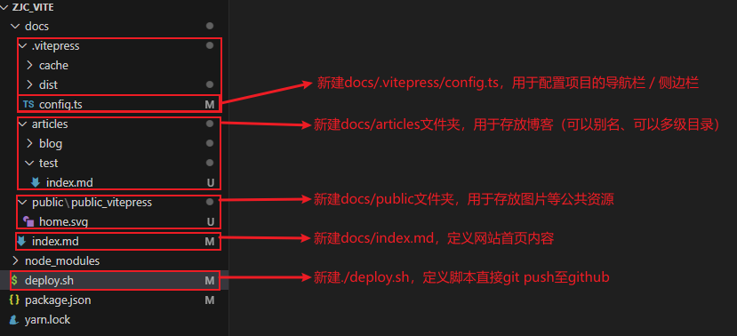


## 配置./package.json

package.json是整个项目的配置，如项目启动、项目打包、项目部署等。

```
"scripts": {
    "dev": "vitepress dev docs",
    "build": "vitepress build docs",
    "serve": "vitepress serve docs"
}
```

运行测试，查看效果

```
yarn dev
```


## 自定义网站首页./docs/index.md

可以直接套用，以后再详细研究。

```
---
layout: home

title: 明日盈盈
titleTemplate: Make each day count, Make learning a habit.

hero:
  name: 
  text: 明日盈盈
  tagline: Make each day count, Make learning a habit.
  actions:
    - theme: brand
      text: Home
      link: /
    - theme: alt
      text: View on Github
      link: https://github.com/mingriyingying

features:
  - icon: 🛠️
    title: Test
    details: Loading...
  - icon: ⚡️
    title: Test
    details: Loading...
  - icon: 🖖
    title: Test
    details: Loading...
---
```

运行测试，查看效果

```
yarn dev
```

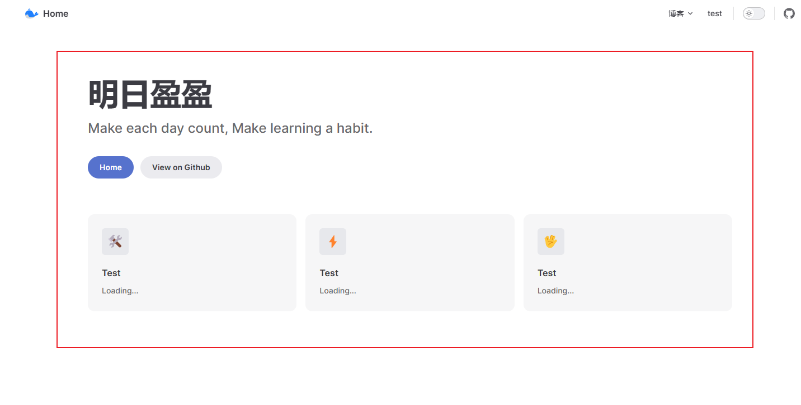


## 创建博客./docs/articles

创建几个markdown文件：

```
articles
	blog
		index.md
		test01.md
		test02.md
	test
		index.md
```


## 自定义导航./docs/.vitepress/config.ts

定义logo和home

```
export default {
    themeConfig: {
        logo: "/home.svg",  // 导航栏最左侧logo
        siteTitle: "Home", // 导航栏最左侧title
    }
}
```

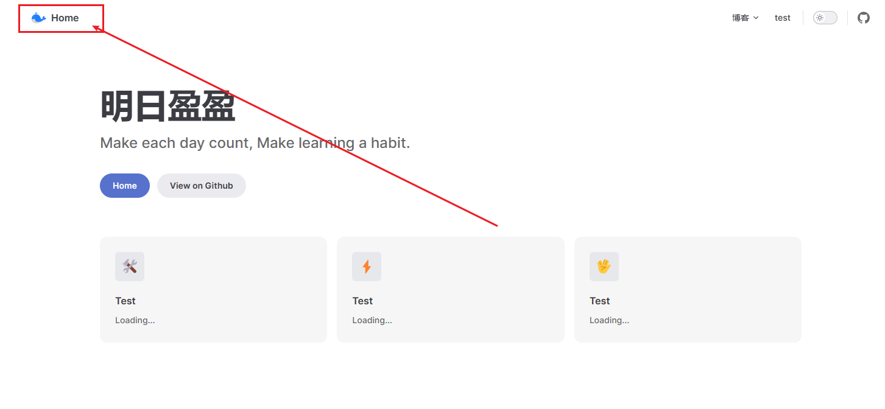


定义菜单

```
export default {
    themeConfig: {
        logo: "/home.svg",  // 导航栏最左侧logo
        siteTitle: "Home", // 导航栏最左侧title
        nav: [
            // 一级菜单
            {
                text: "博客",
                // 二级菜单
                items: [
                    { text: 'test01', link: '/articles/blog/test/' },
                    { text: 'test02', link: '/articles/blog/test02' },
                ]
            },
            // 一级菜单
            { text: "test", link: "/articles/test/" }
        ]
    }
}
```

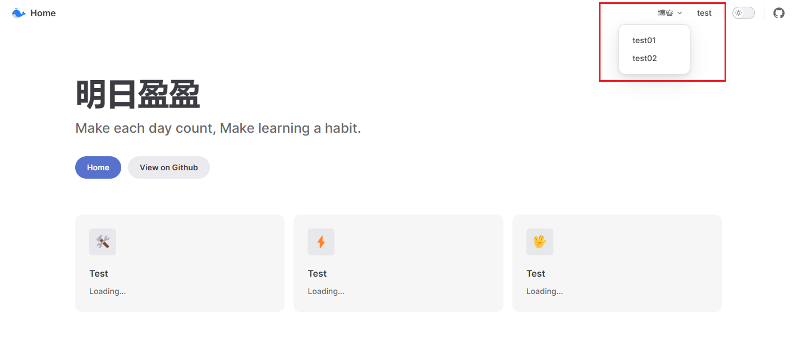


定义侧边栏

```
export default {
        // 侧边栏：指定菜单及对应的侧边栏
        sidebar: {
            "/articles/blog/test": [
                {
                    text: "Test",
                    items: [
                        { text: "test01", link: "/articles/blog/test/test01" },
                        { text: "test02", link: "/articles/blog/test/test02" },
                    ],
                },
            ],

        },
    }
}
```

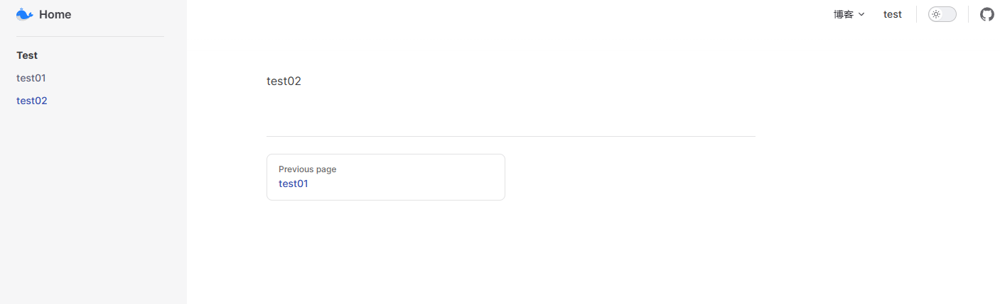


完整配置如下：

```
export default {
    title: "明日盈盈",
    description: '一只程序猿', //mate标签description，多用于搜索引擎抓取摘要
    base: "/", // / 或者 /xxx/
    head: [
        ['link', { rel: 'icon', href: '/home.svg' }], // 网站icon
    ],
    themeConfig: {
        logo: "/home.svg",  // 导航栏最左侧logo
        siteTitle: "Home", // 导航栏最左侧title
        nav: [
            // 一级菜单
            {
                text: "博客",
                // 二级菜单
                items: [
                    { text: 'test01', link: '/articles/blog/test/' },
                    { text: 'test02', link: '/articles/blog/test02' },
                ]
            },
            // 一级菜单
            { text: "test", link: "/articles/test/" }
        ],
        // 导航栏右侧：社交链接
        socialLinks: [
            { icon: "github", link: "https://github.com/mingriyingying" },
        ],
        // 侧边栏：指定菜单及对应的侧边栏
        sidebar: {
            "/articles/blog/test": [
                {
                    text: "Test",
                    items: [
                        { text: "test01", link: "/articles/blog/test/test01" },
                        { text: "test02", link: "/articles/blog/test/test02" },
                    ],
                },
            ],

        },
    }
}

```


# 部署到github

## 项目打包

上面项目记得打包（打包后的文件是 docs/.vitepress/dist）

```
yarn build
```

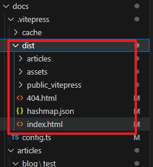


## github创建仓库

创建一个名字叫username.github.io的仓库

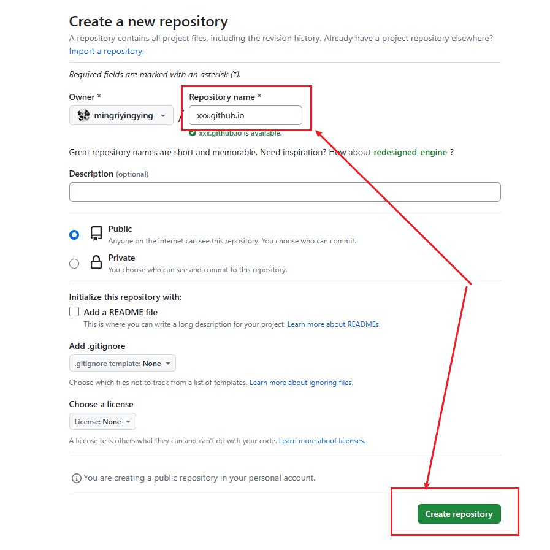

## 上传dist至github

进入本地dist文件夹，按照github首页教程，将dist中的内容push到github

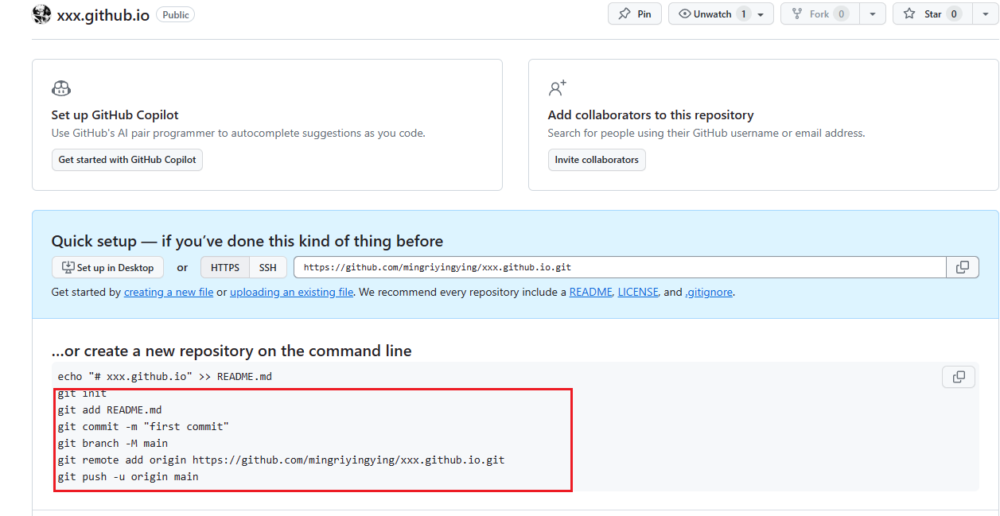


我这里上传到的是deploy分支，默认是main/master分支

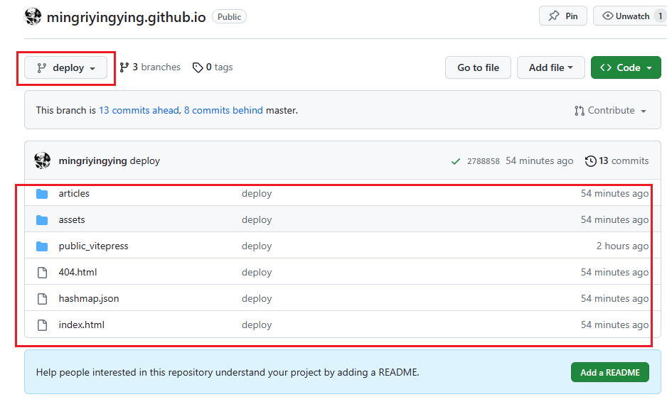


## 设置Github Pages

设置github的setting

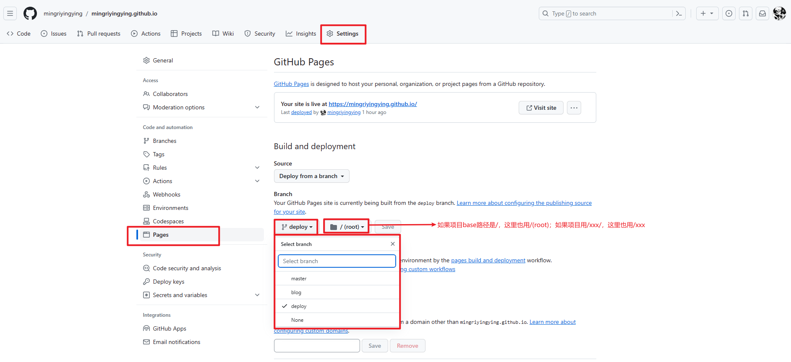

最后访问 https://mingriyingying.github.io/


# 项目进阶配置

## 1、一键部署

在项目根目录下创建./deploy.sh脚本。deploy.sh作用是将项目上传至github等代码仓库。（注意，我这里是上传至deploy分支）

```
#!/usr/bin/env sh

# 确保脚本抛出遇到的错误
set -e

# 生成静态文件

yarn build

# 进入生成的文件夹
cd docs/.vitepress/dist

git init
git add -A
git commit -m 'deploy'

# git push -f git@github.com:你的git名/你的git项目名.git master:你的git分支
git push -f origin deploy

cd -
```

在package.json中添加命令

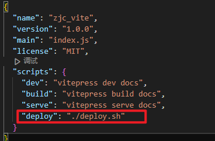

执行命令，完成自动上传至github

```
yarn deploy
```


## 2、自动生成菜单

